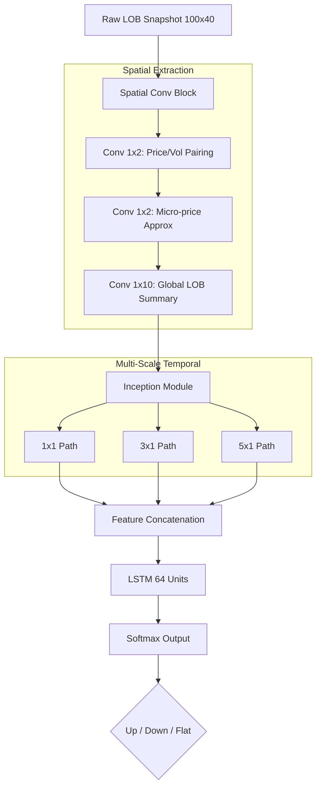

# 📈 Deep-Stonks: Hybrid CNN-LSTM for LOB Prediction

<div align="center">

[](https://www.python.org/downloads/)
[](https://pytorch.org/)
[](https://www.docker.com/)

**State-of-the-art Limit Order Book (LOB) prediction using a spatial-temporal hybrid architecture.**

[Key Features](#-key-features) • [Architecture](#-architecture) • [Benchmarks](#-performance-benchmarks) • [Quick Start](#-quick-start) • [Installation](#-installation)

</div>

---

## 📖 Overview

**Deep-Stonks** is a high-performance PyTorch implementation of the **DeepLOB** architecture, specifically designed for high-frequency financial data. By processing Limit Order Book snapshots, the model predicts short-term price movements (**Up**, **Down**, or **Stationary**) with remarkable precision.

Unlike traditional models, Deep-Stonks handles the raw spatial structure of the LOB and its multi-scale temporal evolution simultaneously, achieving an **F1-Score of ~83.4%** on the FI-2010 benchmark.

---

## ✨ Key Features

- ⚡ **Optimized for PyTorch 2.0+**: Full support for `mps` (Metal) on Apple Silicon and `cuda` on NVIDIA GPUs.
- 🏗️ **Domain-Aware Design**: Implementation of the specific (1,2) stride convolution to respect Price/Volume semantic pairing.
- 🕒 **Multi-Scale Discovery**: Inception modules to capture both micro-scale fluctuations and medium-term trends.
- 🐳 **Production Ready**: Fully containerized with Docker for consistent training environments.
- 🔬 **Research-Driven**: Built based on *Zhang et al. (2018)* with modern optimizations.

---

## 🧠 Architecture

The model utilizes a three-stage hybrid approach to extract alpha from noisy market data:

1.  **Spatial Block**: Extracts "micro-structure" features using level-wise convolutions.
2.  **Inception Module**: Learns multi-scale temporal patterns via parallel filter paths.
3.  **LSTM Layer**: Captures long-term sequential dependencies.



### Why it works?
- **The (1,2) Stride**: Features in a LOB are ordered as `{P_a, V_a, P_b, V_b}`. A standard stride would mix volume and price across different orders. Our implementation uses a stride of 2 to ensure the kernel only processes valid price-volume pairs.
- **Micro-price Approximation**: The second convolutional layer effectively learns to approximate the *micro-price* ($p_{micro} = I \cdot p_a + (1-I) \cdot p_b$), a classic HFT indicator.

---

## 📊 Performance Benchmarks

Evaluated on the **FI-2010** benchmark dataset (Setup 2: Fixed Split).

| Model | Accuracy (%) | Precision (%) | Recall (%) | F1 Score (%) |
| :--- | :---: | :---: | :---: | :---: |
| SVM | - | 39.62 | 44.92 | 35.88 |
| MLP | - | 47.81 | 60.78 | 48.27 |
| LSTM | - | 60.77 | 75.92 | 66.33 |
| CNN | - | 56.00 | 45.00 | 44.00 |
| **DeepLOB (Ours)** | **84.47** | **84.00** | **84.47** | **83.40** |

---

## 🚀 Quick Start

### Installation

```bash
# Clone the repository
git clone https://github.com/akc0r/deep-stonks.git
cd deep-stonks

# Create and activate environment
python -m venv .venv
source .venv/bin/activate  # Windows: .venv\Scripts\activate

# Install requirements
pip install -r requirements.txt
```

### 📥 Dataset Setup

1.  Download the **FI-2010** dataset from [Fairdata Etsin](https://etsin.fairdata.fi/dataset/73eb48d7-4dbc-4a10-a52a-da745b47a649/data).
2.  Extract the archive into the `data/` directory.
3.  Ensure your structure looks like this:
    ```
    data/BenchmarkDatasets/NoAuction/
    ├── 1.NoAuction_Zscore/
    ├── 2.NoAuction_MinMax/
    └── 3.NoAuction_DecPre/
    ```

### Training

```bash
# Standard training session
python main.py --epochs 50 --batch_size 32 --lr 0.01 --k 10
```

| Argument | Default | Description |
| :--- | :--- | :--- |
| `--k` | `10` | Prediction horizon (10, 20, 50, 100 ticks) |
| `--T` | `100` | History window size (timesteps) |
| `--lr` | `0.01` | Learning rate |

---

## 🐳 Docker Deployment

Run the training in a isolated environment:

```bash
# Build the image
docker build -t deep-stonks .

# Run training (mount data directory)
docker run --gpus all -v $(pwd)/data:/app/data deep-stonks
```

## 📜 References

If you use this project in your research, please cite the original paper:

```bibtex
@article{zhang2018deeplob,
  title={DeepLOB: Deep Convolutional Neural Networks for Limit Order Books},
  author={Zhang, Zihao and Zohren, Stefan and Roberts, Stephen},
  journal={arXiv preprint arXiv:1808.03668},
  year={2018}
}
```
